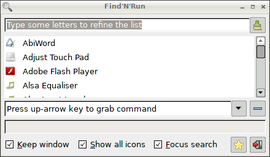

# find-n-run

Simple and quick system application finder for Linux.

## News

 * [Project home](http://github.com/step-/find-n-run)
 * As of version 1.10.5 this script is featured in the _original_
[Find'N'Run](http://www.murga-linux.com/puppy/viewtopic.php?t=98330)
 * Version 1.10.6 runs on Lubuntu: [package information](usr/share/doc/findnrun/DEBIAN.md)

## Introduction, features, installing, help documentation and more

[Click to read...](usr/share/doc/findnrun/index.md)

## Screenshots

Version 1.10.6 (default window size)

## Reporting bugs

Please file bugs against this script in the issues section of the
[github repository](https://github.com/step-/find-n-run/issues) _and not
in the Puppy Linux forum thread_. You do need a github free accont to
file new issues.

## Credits

[Artwork, translations](usr/share/doc/findnrun/CREDITS.md)

## Change Log

See the project [release announcements](https://github.com/step-/find-n-run/releases) page and - for fine-grained information - the [commit history](https://github.com/step-/find-n-run/commits/master) page.

## License

[GNU GPL v2](LICENSE)

