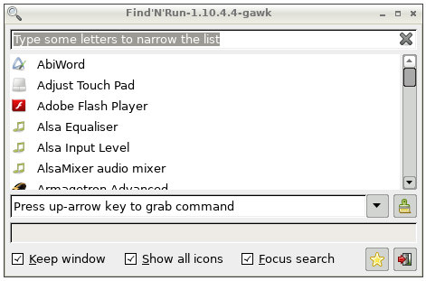
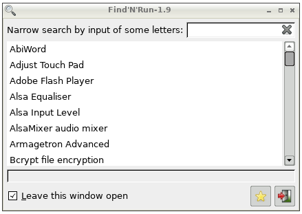
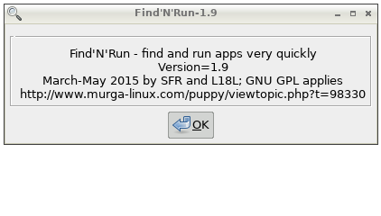

# find-n-run

GNU awk fork of the original find-n-run utility for Puppy linux.

As of version 1.10.5 this script is featured in the original
[Find'N'Run](http://www.murga-linux.com/puppy/viewtopic.php?t=98330),
so you need not worry which one you will be getting.

## Motivation

Puppy linux users SFR and L18L created the original Find'N'Run, a wonderful
light application starter that displays your `*.desktop` files in a
`gtkdialog` window with a progressive typing search field to narrow down the
list. It is all written in shell, optionally augmented with a ROX-Filer
application directory.

The version of Find'N'Run in this repo focuses on the main shell script,
which I have modified to use GNU `awk` instead of the likes of `grep`,
`sed`, `cut`, and `sort`. My main intent was to reduce the number
of processes that need to run when the search field is exercised.

### Naming

_Find'N'Run_ refers to SFS's original utility;
_find-n-run_ refers to this project;
`findnrun` is the script name, the same name in both projects.

## Overview

New features:

 * **Faster searching**.
   It is also possible searching through **application
   comments**, searching for **left-starting matches** only, searching
   using **regular expressions**, and enforcing **case-dependence**.
 * **Application icon** column. [1]
 * **Command line entry** with command history.
   A combobox widget
   tracks the command associated with the currently selected `.desktop`
   item. Pressing up-arrow/down-arrow moves back/forward in the history
   of previously executed commands. [2]
 * **Keyboard focus** control.
   After starting an application focus can be returned to
   either the search input field or to the selected application list item.
 * **Geometry** support to exactly size and position the main window.
 * **New hi-res desktop icon**. 
 * **Extensive tooltips**, and new configurable **user preferences**.

**Notes**

[1] It can happen that some icons unexpectedly look empty.
   Enable option _"Show all icons"_ in the main window to fix the look.

[2] Due to limitations of the `gtkdialog` comboboxentry widget, the
   combobox is normally blank until it is focused **and** up-arrow has
   been pressed at least once. The first key press displays the
   command associated with the current entry.

## Installing

This version can replace directly the `findnrun` script included with
Fatdog64-700, a 64-bit OS in the Puppy linux family, and the script
included in the `.pet` package for all other Puppies. _For older .pet versions
simply replace the existing file `/usr/local/apps/FindNRun/findnrun` with
file `/usr/bin/findnrun` from this repository._

## User Preferences

The user preferences file is created as `~/.findnrunrc` on first run.

Users can specify an alternative preferences file from the shell command line:

    CONFIG="/my/findnrun/conf" /usr/bin/findnrun

### Gui Preferences

These values can be set from the main window:

    # Keep the main window open after starting an item.
    defOPEN=false
    # Show and cache all application icons.
    varICONS=false
    # Return keyboard focus to the search input field.
    varFOCUSSEARCH=true

### Hidden Preferences

These values are hidden in the main window. They are intended mostly for power users and custom applications:

    # Icon cache location.
    ICONCACHE=${HOME}/.icons
    # Extend search to application comments.
    SEARCHCOMMENTS=false
    # Search pattern must match from the leftmost character.
    SEARCHFROMLEFT=false
    # Search pattern is a POSIX Basic regular expression.
    SEARCHREGEX=false
    # Enforce case-dependent searching.
    CASEDEPENDENT=false
    # Main window geometry, no default.
    # Command-line option --geometry=WxH+X+Y overrides this value.
    #GEOMETRY=460x280+100+200

## Command-line options

    --geometry=WxH+X+Y

## Bugs

I beg you to please file bugs against this script in the issues section of the
[github repository](https://github.com/step-/find-n-run/issues)
_and not in the Puppy Linux forum thread_. You do not need a github accont
to file new issues.

## Change Log

See the project [release announcements](https://github.com/step-/find-n-run/releases) page and - for fine-grained information - the [commit history](https://github.com/step-/find-n-run/commits/master) page.

## Screenshots

Side by side: Left: version 1.10.4.4-gawk -- Right: original version 1.9 (Fatdog64-701).

