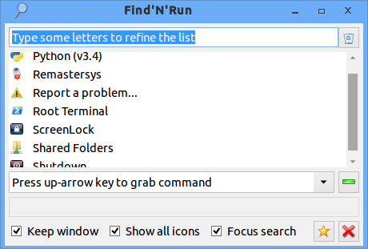

Find-n-run version 1.10.6 successfully runs on Lubuntu.

Supporting Ubuntu-based distros (L/K/Ubuntu, Mint, etc.) is not
a goal of mine, as I am focused on Fatdog64 Linux and do not use
Ubuntu. However, since in my limited testing the script runs fine on
Lubuntu, I will try to keep compatibility in all future releases.

Here is a picture of find-n-run 1.10.6 running on Lubuntu with the WinAte
theme.

## Installing find-n-run on Lubuntu

Download and install the `.deb` package attached to the **latest release**
in the [release page](http://github.com/step-/find-n-run/releases/).

Before you can run find-n-run your system must satisfy all pre-requisites.

## Pre-requisites

To use find-n-run on a plain Lubuntu system you need to install three
packages, which might themselves pull in additional dependencies:

 * GNU awk, **gawk**
 * **gtk-dialog**
 * the **ash** shell

### GNU awk

Find-n-run requires GNU awk. Lubuntu's default mawk just isn't enough.
Start a terminal and run this command:

    sudo apt-get install gawk

### gtk-dialog and libnotify-bin

Ubuntu removed gtk-dialog from the offical repository a few releases ago,
so you need to install gtk-dialog from a contributed repository.
I tested lanzadoc's repository, which includes a 32-bit package only.
An option for 64-bit system is listed further down.

**Using aptitude**

_Note: I only tested the manual installation process, which is described
in the next section._

Browse https://launchpad.net/ubuntu/+source/gtkdialog
and click "Other versions of 'gtkdialog' in untrusted archives".

Add lanzadoc's repository (32-bit only):

    sudo apt-add-repository https://launchpad.net/~geinux/+archive/ubuntu/lanzadoc
    sudo apt-get update

install gtk-dialog, which should
also install the official libnotify-bin package if necessary.

    sudo apt-get gtk-dialog

**Manual installation for 32-bit OS**

Download the `.deb` file directly from lanzadoc's repo:

 * http://ppa.launchpad.net/geinux/lanzadoc/ubuntu/pool/main/g/gtkdialog/
 * http://ppa.launchpad.net/geinux/lanzadoc/ubuntu/pool/main/g/gtkdialog/gtkdialog_0.8.4_i386.deb

Install gtk-dialog by double-clicking the `.deb` file in your file manager
to start your package manager, which should
also install the official libnotify-bin package if necessary.

**Options for 64-bit systems**

Unfortunately, lanzadoc's repository lacks a 64-bit gtk-dialog `.deb` package.
A 64-bit package of an earlier gtk-dialog version 0.8.3.2 is found
on the 'multisystem' sourceforce project
[page](http://sourceforge.net/projects/multisystem/files/gtkdialog-deb/).
Please note that I did not test this package at all.
You are on your own.  Proceed with due caution at your own risk.

Alternatively, if you don't mind mixing binaries, you could download
Fatdog64's own gtk-dialog binary package and dependency libraries from
the official [page](http://distro.ibiblio.org/fatdog/packages/700/),
and extract binary files into their standard locations.

### Ash

If the ash shell isn't already installed you can target busybox as
a symbolic link.
If busybox isn't installed you could target bash instead of busybox.

To create a symbolic link run the following commands in a terminal:

    test -x /bin/ash || sudo ln -s /bin/busybox /bin/ash
    test -x /bin/ash || sudo ln -s /bin/bash /bin/ash

Try running ash in a terminal. If it is still unavailable you could try
changing the first line of file `/usr/bin/findnrun` to reference
`/bin/bash` instead of `/bin/ash`.

