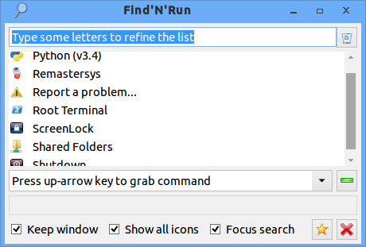

_Note: These instructions concern installing Findnrun on
Debian/Ubuntu/Mint systems. If you are running a Puppy Linux OS, you
need not be concerned._

Findnrun 1.10.6 running on Lubuntu with the WinAte theme.

## Installing Findnrun on Debian/Ubuntu/Mint Systems

**PRE-REQUISITES**: Your system must satisfy the pre-requisites that are
explained in the next section.

After that you will download the `.txz` package attached to the **latest
release** in the [release page](http://github.com/step-/find-n-run/releases/).
Unpack the archive in the root `/` of your filesystem as user "root" (with
sudo).  Findnrun run-time files will be added as follows:

    /install           <- delete this after unpacking
    /usr/bin/findnrun*
    /usr/share/findnrun/doc/*
    /usr/share/applications/findnrun.desktop
    /usr/share/findnrun/*
    /usr/share/icons/hicolor/*/apps/findnrun.*

If you also install the NLS `.txz` package translation files will be added to:

    /install           <- delete this after unpacking
    /usr/share/doc/nls/findnrun/*
    /usr/share/locale

## Pre-requisites

To use findnrun on a plain Debian/Ubuntu/Mint system you need to install
some packages not normally available on such systems (except if you are running
a Debian/Ubuntu "Dog" system).

The list of required packages can be found in the installation requirements
[page](https://github.com/step-/find-n-run/blob/master/usr/share/findnrun/doc/install-require.md).

### GNU awk

Findnrun requires GNU awk, best known as `gawk`.  On some Debian-based
versions, i.e., Lubuntu and others, by default `awk` links to `mawk`,
which isn't sufficiently capable for findnrun. So get `gawk`.

Start a terminal and run this command:

    sudo apt-get install gawk

### gtk-dialog and libnotify-bin

Ubuntu removed gtk-dialog from the offical repository a few releases
ago, so you will need to install gtk-dialog from a contributed repository.  I

Probably the best source for gtk-dialog deb packages is the StretchDog
repository, which is actively maintained.

*  [32-bit repo](https://fredx181.github.io/StretchDog/i386/Packages/Included/)
*  [64-bit repo](https://fredx181.github.io/StretchDog/amd64/Packages/Included/)

You may also need to `apt-get install` lib-notify-bin from your distribution
PPA.

### yad

Yad can be found in the StretchDog repository, and in your distribution PPA.

### mdview

Mdview isn't strictly required to run findnrun, but the help system is definitely better with it so I recommend installing it.
Unfortunately, I don't know of any deb packages for it, so you will need to
compile it from source.

