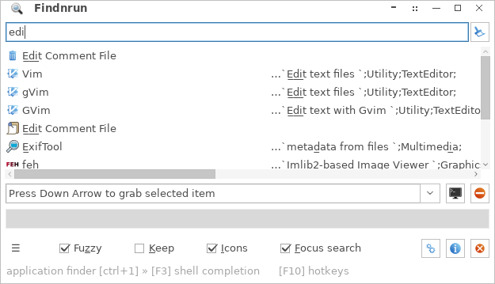
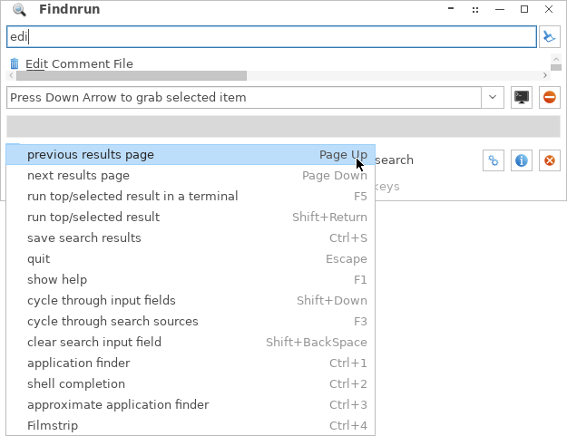
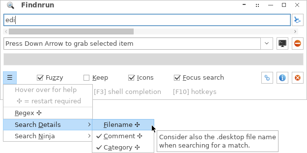
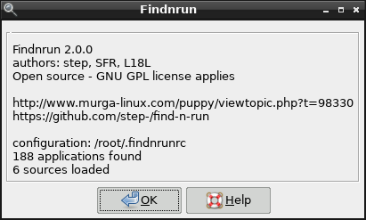
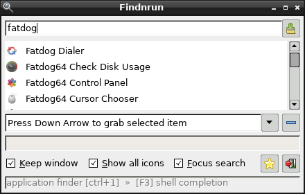
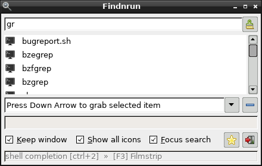
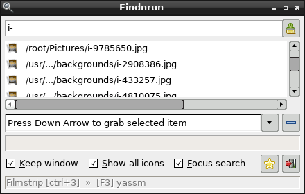
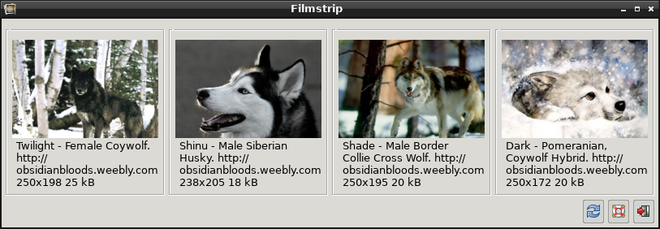
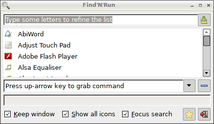
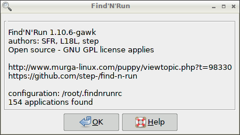

## Screenshots

### Version 3.1.0

Shown with GTK2 theme 'Windows10Light' and GTK2 icon theme 'Clarity' on Fatdog64.

**Main window open on _Application Finder_ fuzzy search results**

The right column shows matches for comments and categories.

**Hotkeys**

Some default and some custom assignments are mixed together.

**Options menu**

----

### Version 2.0.0

Shown with GTK2 theme 'Flat-grey-rounded' and GTK2 icon theme 'ROX' on Fatdog64.

**About dialog**

**Main window open on _Application Finder_ source**

**Main window open on _Shell Completion_ source**

**Filmstrip source**

Main window open on _Filmstrip_ source (top) and _Filmstrip_ viewer (bottom)

----

### Version 1.10.6

Version 1.10.6 (default window size)

